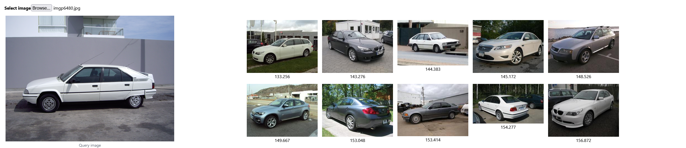

# Image search engine

User-interface and backend for finding images that look similar to an input query image.



Note: the images on the right come 

### Methods
 
- Image features can be created with:
  - A Convolutional Neural Network
  - Bag of Visual Words with keypoint descriptors : Orb, Sift, Surf and Daisy.
- An index for fast search is created using the [Faiss library](https://github.com/facebookresearch/faiss)

### Instructions

- Configure the path towards the local images in `config.py`.

- Create a database of descriptors of the images in the input folder:
```
python indexer.py
```

- Start the local user interface:
```
cd frontend
npm install
npm start
```

- Start the backend in another console:
```
cd backend
python engine.py
```


### Other ideas to explore: 
- Other kinds of Bags of Visual Words like:
  - BOVW with pixel intensities
  - BOVW with Histograms of Oriented Gradients

- Additional descriptors, such as the HSV color descriptor mentioned in [PyImagesearch](https://www.pyimagesearch.com/2014/12/01/complete-guide-building-image-search-engine-python-opencv)